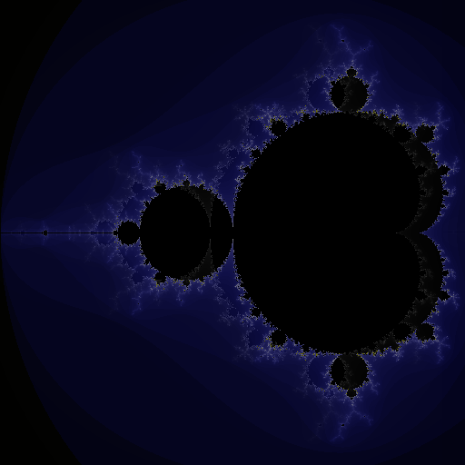
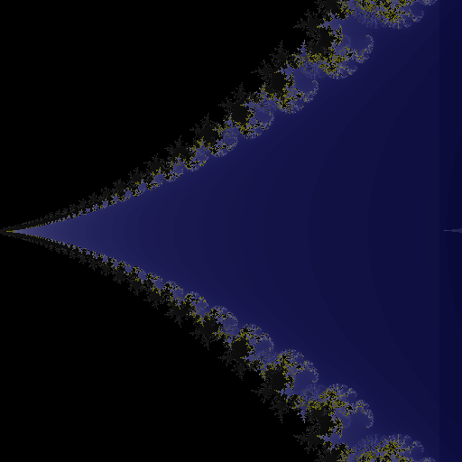
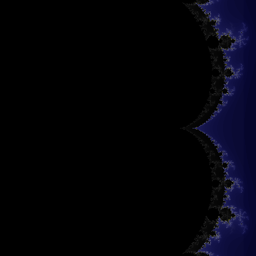
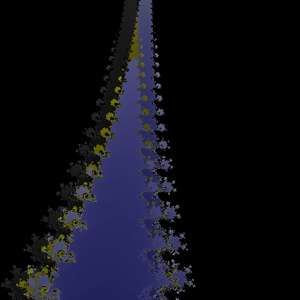

# TBB Mandelbrot
## Generating and visualizing Mandelbrot set/fractal using Threading Building Blocks (TBB) and png++

Project explores `tdd::flow::graph` features in the implementation of a somewhat artifically created need to draw Mandelbrot fractals concurrently and then merge them (for that else could we use `tdd::flow::join`!) into another image. If you look for inspiration how to implement something with TBB, feel free to grab some code and maybe also contribute! I of course can't guarantee that the code is safe and well-written (I know it's a mess), it was my first time with TBB. But look at the images below – something as easy as pixel offset during merge of two images can make interesting effect!

## Gallery

